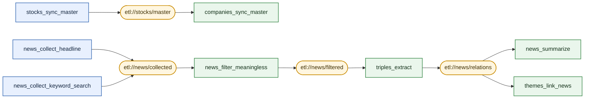

## DAGs

Airflow DAG 정의 폴더.

각 하위 폴더는 **도메인**을 나타내며, Airflow는 이 폴더를 재귀적으로 스캔해서 `@dag`가 선언된 파일을 모두 DAG로 인식한다.

```
dags/
├── companies/    # 법인 마스터 파일 동기화 · GraphDB 반영
├── disclosures/  # DART 공시(단일판매ㆍ공급계약체결) 수집
├── health/       # 운영 상 헬스체크용
├── news/         # 뉴스 수집 · 필터 · 요약
├── stocks/       # 종목 마스터 파일 동기화 · 주가 캔들 수집 · 집계
├── themes/       # 테마 크롤링 · 뉴스 연결
└── triples/     # 트리플 추출
```

> 단, 폴더 구조는 **소스코드 정리용**이다. 
> 
> Airflow UI는 파일 경로가 아니라 `dag_id`와 `tags`로 DAG를 묶어 나열한다.

## DAG 목록

| 도메인 | 파일 | `dag_id` | `tags` | 스케줄 |
|--------|------|----------|--------|--------|
| health | `health/check.py` | `health_check` | `health` | 수동 |
| companies | `companies/sync_master.py` | `companies_sync_master` | `companies` | Asset `etl://stocks/master` |
| stocks | `stocks/sync_master.py` | `stocks_sync_master` | `stocks` | `0 8 * * 1-5` (평일 08시) |
| stocks | `stocks/daily_pipeline.py` | `stocks_daily_pipeline` | `stocks` | `0 18 * * 1-5` (평일 18시) |
| stocks | `stocks/aggregate_candles.py` | `stocks_aggregate_candles` | `stocks` | `*/5 9-16 * * 1-5` (장중 5분) |
| stocks | `stocks/intraday_1m.py` | `stocks_intraday_1m` | `stocks` | `*/5 9-15 * * 1-5` (장중 5분) |
| stocks | `stocks/daily_backfill.py` | `stocks_daily_backfill` | `stocks` | 수동 |
| disclosures | `disclosures/collect_daily_supply_contracts.py` | `disclosures_collect_daily_supply_contracts` | `disclosures` | `0 4 * * *` (매일 04시) |
| disclosures | `disclosures/backfill_supply_contracts.py` | `disclosures_backfill_supply_contracts` | `disclosures` | 수동 |
| news | `news/collect_headline.py` | `news_collect_headline` | `news` | `*/30 * * * *` (30분) |
| news | `news/collect_keyword_search.py` | `news_collect_keyword_search` | `news` | `0 * * * *` (매시) |
| news | `news/filter_meaningless.py` | `news_filter_meaningless` | `news` | Asset `etl://news/collected` |
| news | `news/summarize.py` | `news_summarize` | `news` | Asset `etl://news/relations` |
| themes | `themes/refresh.py` | `themes_refresh` | `themes` | `0 0 * * *` (자정) |
| themes | `themes/link_news.py` | `themes_link_news` | `themes` | Asset `etl://news/relations` |
| triples | `triples/extract.py` | `triples_extract` | `triples` | Asset `etl://news/filtered` |

## 독립실행 Crons

Asset을 생산하지도 소비하지도 않아, 자기 시간표로만 도는 DAG들.

```mermaid
flowchart TB
    SDP["stocks_daily_pipeline<br/><code>0 18 * * 1-5</code>"]
    SAC["stocks_aggregate_candles<br/><code>*/5 9-16 * * 1-5</code>"]
    SI1["stocks_intraday_1m<br/><code>*/5 9-15 * * 1-5</code>"]
    SDB["stocks_daily_backfill<br/>수동"]
    TR["themes_refresh<br/><code>0 0 * * *</code>"]
    HC["health_check<br/>수동"]
    DCD["disclosures_collect_daily_supply_contracts<br/><code>0 4 * * *</code>"]
    DBF["disclosures_backfill_supply_contracts<br/>수동"]

    classDef cron fill:#e8f0fe,stroke:#3b6db5,stroke-width:1.5px,color:#12243d
    class SDP,SAC,SI1,SDB,TR,HC,DCD,DBF cron
```



## Assets 흐름

`Asset`은 **문자열 ID를 가진 이벤트 채널**이다.

태스크가 `outlets=[asset]`을 달고 **성공**하면 Airflow가 해당 Asset에 갱신 이벤트를 기록하고, 그 Asset을 `schedule=`로 받는 DAG가 트리거된다.

따라서 화살표는 데이터 이동이 아니라 **트리거 전파**를 뜻한다.



| 표기 | 의미 |
|------|------|
| 파란 사각형 | cron으로 기동하는 진입점 DAG (→ Asset 화살표는 `outlets`) |
| 노란 스타디움 | Asset (이벤트 채널) |
| 초록 사각형 | Asset 이벤트로만 기동하는 DAG (Asset → 화살표는 `schedule`) |

스케줄은 위 [DAG 목록](#dag-목록) 표에 있으므로 노드에 중복 표기하지 않는다.

## `dag_id`

- **Airflow 전체에서 DAG를 식별하는 고유한 이름.**
- 웹 UI 목록, CLI, 스케줄러, 실행 히스토리·메타데이터 DB가 모두 이 값을 키로 사용한다.

```python
@dag(
    dag_id="news_summarize",   # ← UI에 뜨는 이름, 전역 유일해야 함
    ...
)
```

### 규칙
- **전역 유일**
  - 두 DAG가 같은 `dag_id`를 쓰면 충돌한다.
  - 폴더가 이미 도메인을 나타내지만, UI는 평면(flat) 네임스페이스라 **`dag_id`에는 도메인 접두사를 유지**한다.
- **동사로 시작한다**
- **파일명과 일치시킨다**
  — UI에서 본 `dag_id`로 소스 파일을 바로 찾을 수 있어야 한다.
  - 예: `dag_id="news_summarize"` ↔ `dags/news/summarize.py`
- **결과로 이름 짓는다**
  — 첫 단계나 수단이 아니라 이 DAG가 만들어내는 **상태**를 가리켜야 한다.

### 주의 사항
- `dag_id`를 바꾸면 Airflow는 **완전히 다른 새 DAG로 인식**한다.
- 기존 실행 히스토리·스케줄 상태가 UI에서 분리되므로, **운영 중인 DAG의 `dag_id`는 함부로 바꾸지 않는다.**

## `tags`

**Airflow UI에서 DAG를 필터링·그룹핑하기 위한 라벨.** 실행 로직에는 아무 영향이 없고, 순수하게 UI 탐색용이다.

```python
@dag(
    tags=["news"],   # ← UI 상단 태그 필터에서 "news" 클릭 시 이 DAG가 묶여 보임
    ...
)
```

### Tag 관련 규칙
- **태그는 도메인(폴더명) 하나만 사용한다.**
  - `["news"]`, `["stocks"]`, `["themes"]`, `["triples"]`, `["health"]`, `["disclosures"]`
- 태그는 **여러 DAG가 공유하며 사용하는 것이므로** 세부 동작명은 넣지 않는다.
  - 세부 동작명은 이미 `dag_id`에 담겨 있어 중복이고, 한 번만 쓰이는 태그가 늘어나 UI만 지저분해지기 때문이다.