# DAGs

Airflow DAG 정의 폴더. 각 하위 폴더는 **도메인**을 나타내며, Airflow는 이 폴더를 재귀적으로 스캔해서 `@dag`가 선언된 파일을 모두 DAG로 인식한다.

```
dags/
├── companies/    # 법인 마스터 파일 동기화 · DART/KIS 수집 · 기업 설명 생성
├── disclosures/  # DART 공시(단일판매ㆍ공급계약체결) 수집
├── events/       # 뉴스 클러스터 → Neo4j Event 승격 (news_scheduled_pipeline 의 Asset 으로 기동)
├── health/       # 운영 상 헬스체크용
├── news/         # 뉴스 수집·군집화 → 트리플 추출 → 요약 통합 파이프라인
├── stocks/       # 종목 마스터 파일 동기화 · 주가 캔들 수집 · 파생지표 · 배당
└── themes/       # 테마 크롤링
```

> 단, 폴더 구조는 **소스코드 정리용**이다. Airflow UI는 파일 경로가 아니라 `dag_id`와 `tags`로 DAG를 묶어 나열한다.

## DAG 목록

| 도메인 | 파일 | `dag_id` | `tags` | 스케줄 |
|--------|------|----------|--------|--------|
| companies | `companies/sync_master.py` | `companies_sync_master` | `companies` | Asset ← `etl://stocks/master` **＋** `etl://companies/corp_codes` |
| companies | `companies/sync_dart_corp_codes.py` | `companies_sync_dart_corp_codes` | `companies` | `0 3 * * *` (03시) |
| companies | `companies/dart_pipeline.py` | `companies_dart_pipeline` | `companies` | `0 9 * * *` (09시) |
| companies | `companies/collect_kis_financials.py` | `companies_collect_kis_financials` | `companies` | `0 19 * * 1-5` (평일 19시) |
| companies | `companies/generate_descriptions.py` | `companies_generate_descriptions` | `companies` | `0 4 * * 6` (토 04시) |
| companies | `companies/sync_service_companies.py` | `companies_sync_service_companies` | `companies` | AssetAny ← `etl://themes/stocks`, `etl://companies/linked` |
| disclosures | `disclosures/collect_daily_supply_contracts.py` | `disclosures_collect_daily_supply_contracts` | `disclosures` | `0 4 * * *` (매일 04시) |
| disclosures | `disclosures/backfill_supply_contracts.py` | `disclosures_backfill_supply_contracts` | `disclosures` | 수동 |
| events | `events/promote_clusters.py` | `events_promote_clusters` | `events` | Asset ← `etl://news/clusters` |
| health | `health/check.py` | `health_check` | `health` | 수동 |
| news | `news/scheduled_pipeline.py` | `news_scheduled_pipeline` | `news`, `triples` | `0 6-21 * * *` (06~21시 매 정각) |
| stocks | `stocks/sync_master.py` | `stocks_sync_master` | `stocks` | `0 8 * * 1-5` (평일 08시) |
| stocks | `stocks/daily_pipeline.py` | `stocks_daily_pipeline` | `stocks` | `0 18 * * 1-5` (평일 18시) |
| stocks | `stocks/compute_derived.py` | `stocks_compute_derived` | `stocks` | Asset ← `etl://stocks/daily` **＋** `etl://companies/financials` |
| stocks | `stocks/collect_dividends.py` | `stocks_collect_dividends` | `stocks` | `0 6 * * 6` (토 06시) |
| stocks | `stocks/backfill_daily_candles.py` | `stocks_backfill_daily_candles` | `stocks` | 수동 |
| stocks | `stocks/backfill_investor_flows.py` | `stocks_backfill_investor_flows` | `stocks` | 수동 |
| themes | `themes/sync_master.py` | `themes_sync_master` | `themes` | `0 23 * * 0` (매주 일요일 23시) |

## Asset 의존

시각이 아니라 **앞 단계가 끝났다는 사실**에 걸어야 하는 작업이 있다. cron으로 못 박으면
앞 단계가 늦어지거나 실패한 날에도 그대로 돌아, 낡은 값을 섞은 결과가 조용히 나온다.

```
stocks_sync_master ──────────► etl://stocks/master ──────► companies_sync_master
                     (평일 08시)

stocks_daily_pipeline ───────► etl://stocks/daily ───┐
  (평일 18시, 일봉→기간봉→수급)                       ├──► stocks_compute_derived
companies_collect_kis_financials ─► etl://companies/financials ┘  (PER·PBR·수익률)
  (평일 19시)
```

`stocks_compute_derived`의 `schedule`은 **리스트라서 AND**다 — 두 Asset이 모두 갱신돼야
기동한다. PER은 분기 EPS 4개를 더한 TTM으로 계산하므로 시세와 재무가 모두 필요하다.

```
themes_sync_master ──(load_postgres)──► etl://themes/stocks ────┐
  (일요일 23시)                                                  ├──► companies_sync_service_companies
  extract_judal ∥ extract_naver → merge_themes                   │      (AssetAny: 둘 중 하나만 갱신돼도 기동)
    → (load_neo4j ∥ load_postgres) → embed_themes                │
companies_sync_master ───────────► etl://companies/linked ──────┘
```

`themes_sync_master`에서 Asset을 발행하는 task는 `load_postgres` 하나다 — 수집 대상 파생은
RDB의 테마 편입만 보면 되고, Neo4j 적재나 임베딩이 늦어도 기다릴 이유가 없다. `embed_themes`는
`load_neo4j` 뒤에만 걸려 있어 `load_postgres`와는 독립적으로 실패·재시도된다.

```
news_scheduled_pipeline ──(collect_articles)──► etl://news/clusters ──► events_promote_clusters
  (06~21시 매 정각)                                            (sync_events ∥ generate_events)
```

`collect_articles`는 이번 런에 클러스터를 하나도 생성·갱신하지 않았으면 스킵해 Asset을
발행하지 않는다 — Event로 올리거나 갱신할 것이 없는 시간에 LLM·Neo4j 왕복을 만들지 않기
위해서다. 뒤따르는 `extract_triples`는 `trigger_rule="all_done"`이라 그 스킵과 무관하게
밀린 기사를 처리한다.

## 독립실행 Crons

Asset을 생산하지도 소비하지도 않아, 자기 시간표로만 도는 DAG들.

```mermaid
flowchart TB
    CDP["companies_dart_pipeline<br/><code>0 9 * * *</code>"]
    CGD["companies_generate_descriptions<br/><code>0 4 * * 6</code>"]
    SCD["stocks_collect_dividends<br/><code>0 6 * * 6</code>"]
    SBD["stocks_backfill_daily_candles<br/>수동"]
    SBI["stocks_backfill_investor_flows<br/>수동"]
    HC["health_check<br/>수동"]
    DCD["disclosures_collect_daily_supply_contracts<br/><code>0 4 * * *</code>"]
    DBF["disclosures_backfill_supply_contracts<br/>수동"]

    classDef cron fill:#e8f0fe,stroke:#3b6db5,stroke-width:1.5px,color:#12243d
    class CDP,CGD,SCD,SBD,SBI,HC,DCD,DBF cron
```



## `dag_id`

**Airflow 전체에서 DAG를 식별하는 고유한 이름.** 웹 UI 목록, CLI, 스케줄러, 실행 히스토리·메타데이터 DB가 모두 이 값을 키로 사용한다.

```python
@dag(
    dag_id="news_scheduled_pipeline",   # ← UI에 뜨는 이름, 전역 유일해야 함
    ...
)
```

### 규칙
- **전역 유일** — 두 DAG가 같은 `dag_id`를 쓰면 충돌한다.
  - 폴더가 이미 도메인을 나타내지만, UI는 평면(flat) 네임스페이스라 **`dag_id`에는 도메인 접두사를 유지**한다.
- **파일명 = `dag_id`에서 도메인 접두사를 뺀 것** — UI에서 본 `dag_id`로 소스 파일을 바로 찾을 수 있어야 한다.
  - 예: `dag_id="news_scheduled_pipeline"` ↔ `dags/news/scheduled_pipeline.py`, `dag_id="companies_collect_kis_financials"` ↔ `dags/companies/collect_kis_financials.py`
- **단일 task DAG는 job 이름(동사구)을, 복수 task 오케스트레이션 DAG는 `*_pipeline` 명사형을 쓴다.**
  세부 규칙과 동사 사전은 루트 `README.md`의 "네이밍" 섹션을 따른다.

### 주의 사항
`dag_id`를 바꾸면 Airflow는 **완전히 다른 새 DAG로 인식**한다. 기존 실행 히스토리·스케줄 상태가 UI에서 분리되므로, **운영 중인 DAG의 `dag_id`는 함부로 바꾸지 않는다.**

## `tags`

**Airflow UI에서 DAG를 필터링·그룹핑하기 위한 라벨.** 실행 로직에는 아무 영향이 없고, 순수하게 UI 탐색용이다.

```python
@dag(
    tags=["news"],   # ← UI 상단 태그 필터에서 "news" 클릭 시 이 DAG가 묶여 보임
    ...
)
```

### Tag 관련 규칙
- **태그는 도메인(폴더명) 하나만 사용한다.**
  - `["news"]`, `["stocks"]`, `["themes"]`, `["triples"]`, `["health"]`, `["disclosures"]`, `["companies"]`
- 태그는 **여러 DAG가 공유하며 사용하는 것이므로** 세부 동작명은 넣지 않는다.
  - 세부 동작명은 이미 `dag_id`에 담겨 있어 중복이고, 한 번만 쓰이는 태그가 늘어나 UI만 지저분해지기 때문이다.
