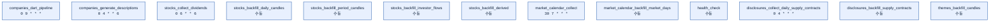

# DAGs

Airflow DAG 정의 폴더. 각 하위 폴더는 **도메인**을 나타내며, Airflow는 이 폴더를 재귀적으로 스캔해서 `@dag`가 선언된 파일을 모두 DAG로 인식한다.

```
dags/
├── companies/    # 법인 마스터 파일 동기화 · DART/KIS 수집 · 기업 설명 생성 · 미국 상장사 크롤링·적재 · 개체 사전
├── disclosures/  # DART 공시(단일판매ㆍ공급계약체결) 수집
├── events/       # 뉴스 클러스터 → Neo4j Event 승격 (news_collect_articles 의 Asset 으로 기동)
├── market_calendar/  # 휴장일·예탁원 일정(배당·증자·주총)·공모주·DART 공모 신고서 수집
├── health/       # 운영 상 헬스체크용
├── news/         # 뉴스 수집·군집화 · 요약 (요약은 triples 의 Asset 으로 기동)
├── stocks/       # 종목 마스터 파일 동기화 · 주가 캔들 수집 · 파생지표 · 배당
├── themes/       # 테마 크롤링 · 테마 지수 봉 백필
└── triples/      # 뉴스 삼중항 추출 (news 의 Asset 으로 기동)
```

> 단, 폴더 구조는 **소스코드 정리용**이다. Airflow UI는 파일 경로가 아니라 `dag_id`와 `tags`로 DAG를 묶어 나열한다.

## DAG 목록

| 도메인 | 파일 | `dag_id` | `tags` | 스케줄 |
|--------|------|----------|--------|--------|
| companies | `companies/sync_master.py` | `companies_sync_master` | `companies` | AssetAny ← `etl://stocks/master`, `etl://companies/corp_codes` |
| companies | `companies/sync_dart_corp_codes.py` | `companies_sync_dart_corp_codes` | `companies` | `0 3 * * *` (03시) |
| companies | `companies/dart_pipeline.py` | `companies_dart_pipeline` | `companies` | `0 9 * * *` (09시) |
| companies | `companies/collect_kis_financials.py` | `companies_collect_kis_financials` | `companies` | `0 19 * * 1-5` (평일 19시) |
| companies | `companies/generate_descriptions.py` | `companies_generate_descriptions` | `companies` | `0 4 * * 6` (토 04시) |
| companies | `companies/sync_service_companies.py` | `companies_sync_service_companies` | `companies` | AssetAny ← `etl://themes/stocks`, `etl://companies/linked` |
| companies | `companies/crawl_us.py` | `companies_crawl_us` | `companies` | `0 22 * * 0` (일요일 22시) |
| companies | `companies/load_us.py` | `companies_load_us` | `companies` | Asset ← `etl://companies/us_crawled` |
| companies | `companies/sync_gazetteer.py` | `companies_sync_gazetteer` | `companies` | AssetAny ← `etl://companies/master_synced`, `etl://companies/us_loaded` |
| disclosures | `disclosures/collect_daily_supply_contracts.py` | `disclosures_collect_daily_supply_contracts` | `disclosures` | `0 4 * * *` (매일 04시) |
| disclosures | `disclosures/backfill_supply_contracts.py` | `disclosures_backfill_supply_contracts` | `disclosures` | 수동 |
| market_calendar | `market_calendar/collect.py` | `market_calendar_collect` | `market_calendar` | `30 7 * * *` (매일 07:30) |
| market_calendar | `market_calendar/backfill_market_days.py` | `market_calendar_backfill_market_days` | `market_calendar`, `backfill`, `manual` | 수동 |
| health | `health/check.py` | `health_check` | `health` | 수동 |
| news | `news/collect_articles.py` | `news_collect_articles` | `news` | Asset ← `etl://themes/hot` **또는** cron (평일 07:30·18·21시, 주말 09·15·21시) |
| news | `news/cluster_articles.py` | `news_cluster_articles` | `news` | Asset ← `etl://news/articles` |
| news | `news/backfill_krx100.py` | `news_backfill_krx100` | `news`, `backfill`, `manual` | 수동 |
| news | `news/backfill_cluster_articles.py` | `news_backfill_cluster_articles` | `news`, `backfill` | Asset ← `etl://news/backfill-articles` |
| stocks | `stocks/sync_master.py` | `stocks_sync_master` | `stocks` | `0 8 * * 1-5` (평일 08시) |
| stocks | `stocks/intraday_candles.py` | `stocks_intraday_candles` | `stocks` | `0 9-17 * * 1-5` (평일 09~17시 매 정각), `etl://themes/hot` 발행 |
| stocks | `stocks/daily_pipeline.py` | `stocks_daily_pipeline` | `stocks` | `0 18 * * 1-5` (평일 18시) |
| stocks | `stocks/compute_derived.py` | `stocks_compute_derived` | `stocks` | Asset ← `etl://stocks/daily` **＋** `etl://companies/financials` |
| stocks | `stocks/collect_dividends.py` | `stocks_collect_dividends` | `stocks` | `0 6 * * 6` (토 06시) |
| stocks | `stocks/backfill_daily_candles.py` | `stocks_backfill_daily_candles` | `stocks`, `backfill`, `manual` | 수동 |
| stocks | `stocks/backfill_period_candles.py` | `stocks_backfill_period_candles` | `stocks`, `backfill`, `manual` | 수동 |
| stocks | `stocks/backfill_investor_flows.py` | `stocks_backfill_investor_flows` | `stocks`, `backfill`, `manual` | 수동 |
| stocks | `stocks/backfill_derived.py` | `stocks_backfill_derived` | `stocks`, `backfill`, `manual` | 수동 |
| themes | `themes/sync_master.py` | `themes_sync_master` | `themes` | `0 23 * * 0` (매주 일요일 23시) |
| themes | `themes/backfill_candles.py` | `themes_backfill_candles` | `themes`, `backfill`, `manual` | 수동 |
| triples | `triples/extract_triples.py` | `triples_extract_triples` | `triples` | Asset ← `etl://news/clusters` |

## Asset 의존

시각이 아니라 **앞 단계가 끝났다는 사실**에 걸어야 하는 작업이 있다. cron으로 못 박으면
앞 단계가 늦어지거나 실패한 날에도 그대로 돌아, 낡은 값을 섞은 결과가 조용히 나온다.

```
stocks_sync_master ──────────► etl://stocks/master ──────────┐
                     (평일 08시)                                ├──► companies_sync_master
companies_sync_dart_corp_codes ─► etl://companies/corp_codes ──┘     (AssetAny: 둘 중 하나만 갱신돼도 기동)
                     (매일 03시)

stocks_daily_pipeline ───────► etl://stocks/daily ───┐
  (평일 18시, 일봉→[기간봉 ∥ 테마 일봉→테마 기간봉]→수급)  ├──► stocks_compute_derived
companies_collect_kis_financials ─► etl://companies/financials ┘  (PER·PBR·수익률 → 핫테마 발행 → 브리핑)
  (평일 19시)
```

`stocks_compute_derived`의 `schedule`은 **리스트라서 AND**다 — 두 Asset이 모두 갱신돼야
기동한다. PER은 분기 EPS 4개를 더한 TTM으로 계산하므로 시세와 재무가 모두 필요하다.

테마 지수 봉(`theme_candles_daily`·`theme_candles_period`)은 종목 일봉으로 계산하는 시총 가중
지수다. 수급 태스크가 테마 봉 뒤에 있으므로 `etl://stocks/daily` 는 테마 봉까지 있는 상태에서
발행되고, `stocks_compute_derived` 의 핫테마 발행이 테마 봉을 읽을 수 있다. 장중에는
`stocks_intraday_candles` 가 매시간 같은 lookback 구간을 다시 계산한다.

> **배포 순서(테마 봉).** `V5__theme_candles.sql` 을 먼저 적용하고 `themes_backfill_candles` 를 장외 시간에 한 번 실행한다. V5 없이 배포하면 `calculate_theme_daily` 가 실패해 `etl://stocks/daily` 가 발행되지 않고 파생·핫테마·브리핑이 그날 멈춘다.

종목·테마 봉 네 테이블의 `change_rate` 는 직전 봉 종가 대비 등락률(%)이다. 일봉은 직전 거래일,
주봉·월봉은 직전 주·월 봉이 기준이고 첫 봉은 NULL 이다. 봉 적재와 분리된 태스크
(`calculate_stock_change_rates`·`calculate_theme_change_rates`, 백필 DAG 는 `calculate_change_rates`)가
적재 뒤에 다시 받은 구간 전체를 재계산한다. 테마는 체인 지수라 지수 종가의 비가 곧 구성 종목
등락률의 가중 평균이다.

> **배포 순서(등락률).** `V6__candle_change_rate.sql`(컬럼만 추가)을 코드보다 먼저 적용한다. V6 없이 배포하면 등락률 태스크가 실패해 `etl://stocks/daily` 가 발행되지 않는다. 기존 행은 `themes_backfill_candles` 와, 종목은 `pipelines.stocks.jobs.calculate_change_rates` 의 `run_daily`·`run_period` 를 과거 `since` 로 한 번 실행해 채운다(KIS 재수집 불필요).

```
themes_sync_master ──(load_postgres)──► etl://themes/stocks ────┐
  (일요일 23시)                                                  ├──► companies_sync_service_companies
  extract_judal → merge_themes (naver 는 사이트 개편으로 제외)                   │      (AssetAny: 둘 중 하나만 갱신돼도 기동)
    → load_postgres → load_neo4j → embed_themes                  │
companies_sync_master ───────────► etl://companies/linked ──────┘
```

`themes_sync_master`에서 Asset을 발행하는 task는 `load_postgres` 하나다 — 수집 대상 파생은
RDB의 테마 편입만 보면 되고, Neo4j 적재나 임베딩이 늦어도 기다릴 이유가 없다. `embed_themes`는
맨 마지막(`load_neo4j` 뒤)에 돌고, Asset 발행 이후라 실패해도 수집 대상 파생을 막지 않는다.
임베딩이 없는 노드·간선만 대상이라 재시도는 남은 분량부터 이어서 채운다.

```
companies_crawl_us ──(crawl_overview)──► etl://companies/us_crawled ──► companies_load_us
  (일요일 22시, Wikipedia·한경 인덱스 → 네이버 overview)          (load_postgres → load_neo4j)

companies_sync_master ──(seed_graph, 매 회차)──► etl://companies/master_synced ──┐
companies_load_us ──────(load_neo4j)──────────► etl://companies/us_loaded ──────┴──► companies_sync_gazetteer
                                                              (AssetAny, entity_gazetteer 전량 재생성)
```

미국 상장사는 크롤링과 적재를 별도 DAG 로 나눈다 — 크롤링은 외부 사이트에 좌우돼 재시도가 잦고,
적재만 다시 돌릴 일도 있다. 크롤링 산출물은 `pipelines/companies/data/{YYYYMMDD}/` 에 남고,
`companies_load_us` 의 `resolve_paths` 가 최신 날짜 폴더를 찾아 읽는다(XCom 으로 넘기지 않는다).

개체 사전(`entity_gazetteer`)은 상장 기업의 본문 표기 → `company_id`·`stock_id`·`ticker` 스냅샷이다.
news(제목·본문 기업 매치)·triples 가 `pipelines/common/gazetteer.py` 로 읽는다. 기업 판정은 news 가
끝내 `news_companies` 에 저장한다 — events 는 사전을 읽지 않고 그 연결을 쓰고, triples 는 엔티티를
추출·검증하지 않고 그 연결에 든 기업의 본문 표기만 사전으로 되찾는다. `etl://companies/linked` 가 아니라
`master_synced` 에 거는 이유는 사명 변경·상폐·별칭 추가가 종목 연결 수를 바꾸지 않기 때문이다 —
`master_synced` 는 `trigger_rule="all_done"` 인 `seed_graph` 가 발행하므로 `sync_master` 가 스킵된
날에도 나온다. 새 사전이 기존의 절반 미만이면 교체하지 않고 실패한다.

> **배포 순서(개체 사전).** `V9__entity_gazetteer.sql` 을 적용하고 `companies_sync_gazetteer` 를
> 한 번 수동 실행한 뒤 news·triples 코드를 배포한다. 사전이 비어 있으면 두 DAG 가 실패한다.

```
stocks_intraday_candles ──(publish_hot_themes)──► etl://themes/hot ──► news_collect_articles
  (평일 09~17시 매 정각)                                  (또는 cron: 평일 07:30·18·21시, 주말 09·15·21시)

news_collect_articles ──► etl://news/articles ──────────► news_cluster_articles ──────────┐
  (위 Asset 또는 cron)      (collect_articles)                                              ├──► etl://news/clusters ──► triples_extract_triples
news_backfill_krx100 ───► etl://news/backfill-articles ──► news_backfill_cluster_articles ─┘   (promote_clusters 가 발행)
  (수동)                    (publish_backfill, 전체 청크가 끝난 뒤 1회)

news_cluster_articles·news_backfill_cluster_articles:
  assign_clusters ──► promote_clusters ──┬──► generate_events
                                         └──► summarize_articles
```

`collect_articles`는 이번 런에 새로 저장한 기사가 없으면 스킵해 Asset을 발행하지 않는다 — 판정할
기사가 없는 시간에 클러스터 DAG를 깨우지 않기 위해서다. `promote_clusters`는 삼중항 미처리 대표
기사가 하나도 없으면 스킵한다. 이번 런에 승격이 없어도 지난 런에 추출이 실패한 대표가 남아 있으면
다시 발행한다.

백필은 클러스터 DAG를 따로 둔다. 청크마다 판정하면 뒤 청크 기업의 기사가 앞 청크가 만든 클러스터의
시간 창보다 이르게 도착해 같은 사건이 갈라지므로, `publish_backfill`이 모든 청크가 끝난 뒤 한 번만
발행한다(실패한 청크가 있으면 발행하지 않는다). `news_backfill_cluster_articles`는 task 구성이
`news_cluster_articles`와 같고, 저장된 IDF 표에 배치 문서 수를 더해 판정하는 점만 다르다 — 초기
백필에는 표가 비어 있다.

> **백필 중에는 `news_cluster_articles`를 꺼 둔다.** 두 클러스터 DAG 모두 출처를 가리지 않고
> `cluster_id`가 없는 기사 전량을 읽는다. 켜 두면 정시 수집이 깨운 `news_cluster_articles`가 수집
> 중인 백필 기사를 먼저 판정하고, 두 DAG가 겹쳐 돌면 같은 사건에 클러스터가 둘 생긴다.
> `news_backfill_cluster_articles`가 끝난 뒤 다시 켠다.

수집·클러스터·삼중항을 DAG 셋으로 나눈 이유:

- **클러스터 중복 생성 방지.** 수집 잡은 클러스터를 쓰지 않는다. 수집 런마다 판정하면 겹쳐 돌 때
  같은 사건에 클러스터가 둘 생긴다. 클러스터 DAG에 `max_active_runs=1`이면 직렬화된다. 백필 전용
  클러스터 DAG와는 서로 막지 않으므로 위 운영 규칙으로 겹치지 않게 한다.
- **중복 추출 방지.** `extract_triples`는 `triple_extracted IS NULL`인 대표 기사를 락 없이 전량
  폴링한다. 같은 이유로 DAG 하나에 둔다.
- **수집 주기 보호.** 삼중항 추출은 런당 상한이 없어 한 시간을 넘길 수 있다. 같은 DAG에 있으면
  다음 정시 수집이 밀린다.
- **백필 점진 처리.** 백필은 청크가 끝날 때마다 Asset을 발행하므로 수집이 다 끝나길 기다리지
  않고 클러스터 판정과 삼중항 추출이 나란히 진행된다. 런이 도는 동안 쌓인 이벤트는 다음 런 하나로
  합쳐진다.

요약과 Event 생성은 클러스터 DAG의 task다. 대상이 클러스터 대표 기사라 삼중항 추출을 기다리지
않고, `promote_clusters`가 스킵돼도 돈다(`trigger_rule="none_failed"`).

기업 판정은 수집 DAG가 끝낸다. 제목의 기업은 관련성 필터가, 본문에만 나온 기업은 엔티티 필터가
판정해 `news_companies`에 저장하고, 클러스터·Event·삼중항은 그 연결을 읽기만 한다.

> **실패분 재시도.** 삼중항 추출·요약·제목 생성에 실패한 것은 미처리로 남아 다음 런에 다시
> 시도된다. 다음 런은 클러스터 DAG가 다시 도는 시점, 즉 **새 기사가 저장된 시점**에 온다 — 수집이
> 0건으로 스킵된 시간에는 재시도도 없다. 급하면 `news_cluster_articles`나
> `triples_extract_triples`를 수동 트리거한다.

`select_themes`가 백엔드가 Redis(`etl:hot-themes`, `HOT_THEMES_REDIS_URL`)에 발행한 핫테마를
읽고 — 조회 실패·키 없음이거나 기준일이 DB 거래일 범위(밸류에이션까지 있는 마감일 ~ 일봉만 있는
최신일) 밖이면 폴백 없이 태스크가 실패한다 — `collect_articles`가 페이로드에 담긴 종목(없으면 그
테마의 편입 기업 전체)을 검색한다(`NEWS_SEARCH_QUERY_TEMPLATES` 기본 `{종목명},공급`·`계약`·`수혜`·`호재`·`악재`·`특징주` 여섯 번, 최신순, 기업별
`search_history.last_searched_at`이 워터마크이자 2시간 간격 판정 기준). 수동 트리거 conf 의
`theme_ids`가 있으면 선정을 건너뛰고 그 테마만 쓴다.

초기 뉴스 백필(`news_backfill_krx100`)은 대상만 `stocks.krx100` 활성 종목의 기업으로 바뀌고,
검색어(같은 `NEWS_SEARCH_QUERY_TEMPLATES` 여섯 개)와 워터마크 규칙은 위와 같다. 수집 창만 트리거
params(`lookback_days`·`max_pages`)로 넓힌다.

## 독립실행 Crons

Asset을 생산하지도 소비하지도 않아, 자기 시간표로만 도는 DAG들.


```mermaid
flowchart TB
    CDP["companies_dart_pipeline<br/><code>0 9 * * *</code>"]
    CGD["companies_generate_descriptions<br/><code>0 4 * * 6</code>"]
    SCD["stocks_collect_dividends<br/><code>0 6 * * 6</code>"]
    SBD["stocks_backfill_daily_candles<br/>수동"]
    SBP["stocks_backfill_period_candles<br/>수동"]
    SBI["stocks_backfill_investor_flows<br/>수동"]
    SBV["stocks_backfill_derived<br/>수동"]
    MCC["market_calendar_collect<br/><code>30 7 * * *</code>"]
    MCB["market_calendar_backfill_market_days<br/>수동"]
    HC["health_check<br/>수동"]
    DCD["disclosures_collect_daily_supply_contracts<br/><code>0 4 * * *</code>"]
    DBF["disclosures_backfill_supply_contracts<br/>수동"]
    TBC["themes_backfill_candles<br/>수동"]

    classDef cron fill:#e8f0fe,stroke:#3b6db5,stroke-width:1.5px,color:#12243d
    class CDP,CGD,SCD,SBD,SBP,SBI,SBV,MCC,MCB,HC,DCD,DBF,TBC cron
```

## `dag_id`

**Airflow 전체에서 DAG를 식별하는 고유한 이름.** 웹 UI 목록, CLI, 스케줄러, 실행 히스토리·메타데이터 DB가 모두 이 값을 키로 사용한다.

```python
@dag(
    dag_id="news_collect_articles",   # ← UI에 뜨는 이름, 전역 유일해야 함
    ...
)
```

### 규칙
- **전역 유일** — 두 DAG가 같은 `dag_id`를 쓰면 충돌한다.
  - 폴더가 이미 도메인을 나타내지만, UI는 평면(flat) 네임스페이스라 **`dag_id`에는 도메인 접두사를 유지**한다.
- **파일명 = `dag_id`에서 도메인 접두사를 뺀 것** — UI에서 본 `dag_id`로 소스 파일을 바로 찾을 수 있어야 한다.
  - 예: `dag_id="news_collect_articles"` ↔ `dags/news/collect_articles.py`, `dag_id="companies_collect_kis_financials"` ↔ `dags/companies/collect_kis_financials.py`
- **단일 task DAG는 job 이름(동사구)을, 복수 task 오케스트레이션 DAG는 `*_pipeline` 명사형을 쓴다.**
  세부 규칙과 동사 사전은 루트 `README.md`의 "네이밍" 섹션을 따른다.

### 주의 사항
`dag_id`를 바꾸면 Airflow는 **완전히 다른 새 DAG로 인식**한다. 기존 실행 히스토리·스케줄 상태가 UI에서 분리되므로, **운영 중인 DAG의 `dag_id`는 함부로 바꾸지 않는다.**

## `tags`

**Airflow UI에서 DAG를 필터링·그룹핑하기 위한 라벨.** 실행 로직에는 아무 영향이 없고, 순수하게 UI 탐색용이다.

```python
@dag(
    tags=["news"],   # ← UI 상단 태그 필터에서 "news" 클릭 시 이 DAG가 묶여 보임
    ...
)
```

### Tag 관련 규칙
- **태그는 도메인(폴더명)을 기본으로 한다.**
  - `["news"]`, `["stocks"]`, `["themes"]`, `["triples"]`, `["health"]`, `["disclosures"]`, `["companies"]`, `["events"]`, `["market_calendar"]`
  - 수동 실행 백필 DAG만 예외로 `backfill`, `manual` 을 덧붙인다(예: `["stocks", "backfill", "manual"]`). 스케줄 DAG와 섞이지 않게 UI에서 따로 거르기 위함이다.
- 태그는 **여러 DAG가 공유하며 사용하는 것이므로** 세부 동작명은 넣지 않는다.
  - 세부 동작명은 이미 `dag_id`에 담겨 있어 중복이고, 한 번만 쓰이는 태그가 늘어나 UI만 지저분해지기 때문이다.
